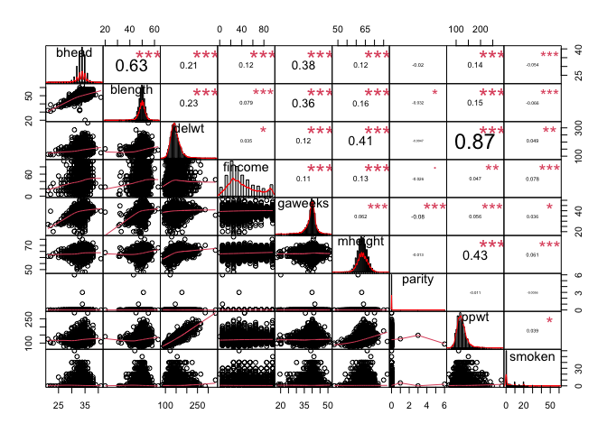

p8105_hw6_fx2184
================
Fei
2022-12-03

## Problem 2 Washingtong Post - Homicides

``` r
#import the dataset 
url = "https://raw.githubusercontent.com/washingtonpost/data-homicides/master/homicide-data.csv"
homicides_raw = read_csv(url)
```

    ## Rows: 52179 Columns: 12
    ## ── Column specification ────────────────────────────────────────────────────────
    ## Delimiter: ","
    ## chr (9): uid, victim_last, victim_first, victim_race, victim_age, victim_sex...
    ## dbl (3): reported_date, lat, lon
    ## 
    ## ℹ Use `spec()` to retrieve the full column specification for this data.
    ## ℹ Specify the column types or set `show_col_types = FALSE` to quiet this message.

``` r
# create variable city_state and clean the dataset
homicides = homicides_raw %>% 
  janitor::clean_names() %>% 
  mutate(city_state = str_c(city, state,sep = ", "),
         victim_age = as.numeric(victim_age),
         victim_race = fct_relevel(victim_race, "White"),
         resolved = case_when(
           disposition == "Closed by arrest" ~ 1,
           disposition ==  "Open/No arrest" ~ 0,
           disposition ==  "Closed without arrest" ~ 0
         ),
         reported_date = as.Date(as.character(reported_date), format = "%Y%m%d")) %>% 
  filter(!(city_state %in% c("Dallas, TX", "Phoenix, AZ", "Kansas City, MO","Tulsa, AL")))%>% 
  filter(victim_race  %in% c("White", "Black"))
```

``` r
## generate glm model, let binary variable resolved as outcome, and age, sex and race as predictors. 
Baltimoe_fit_logistic = homicides %>% 
    filter(city_state  %in% c("Baltimore, MD")) %>% 
    glm(resolved ~ victim_age + victim_sex +victim_race, data = ., family = binomial()) 

## Table below summaries the coefficients from the model fit
Baltimoe_fit_logistic%>% 
  broom::tidy(conf.int = T) %>% 
  mutate(OR = exp(estimate),
         CI_Lower = exp(conf.low),
         CI_Upper = exp(conf.high)) %>%
  select(term, log_OR = estimate, OR, CI_Lower, CI_Upper, p.value) %>% 
  knitr::kable(align = "lrr",
               col.names = c("Term","Estimate","OR", "95% CI Lower", "95% CI Upper", "P-value"),
               digits = 3)
```

| Term             | Estimate |    OR | 95% CI Lower | 95% CI Upper | P-value |
|:-----------------|---------:|------:|:-------------|-------------:|--------:|
| (Intercept)      |    1.152 | 3.164 | 1.998        |        5.057 |   0.000 |
| victim_age       |   -0.007 | 0.993 | 0.987        |        1.000 |   0.043 |
| victim_sexMale   |   -0.854 | 0.426 | 0.324        |        0.558 |   0.000 |
| victim_raceBlack |   -0.842 | 0.431 | 0.305        |        0.606 |   0.000 |

-   In Baltimore, MD. Homicides in which the victim is Black are
    substantially less likely to be resolved that those in which the
    victim is white.
-   In Baltimore, MD. Homicides in which the victim is male are
    significantly less like to be resolved than those in which the
    victim is female.
-   The effect of age is statistically significant, but careful data
    inspections should be conducted before interpreting too deeply.

``` r
# glm for each of the cities in your dataset, and extract the adjusted odds ratio (and CI) for solving homicides 
allcities_logistic = homicides %>% 
  nest(data = -city_state) %>% 
  mutate(
    models = map(data, ~glm(resolved ~ victim_age + victim_race + victim_sex, data = ., family = binomial())),
    results = map(models, ~broom::tidy(.x, conf.int = T))) %>% 
  select(-data, -models) %>% 
  unnest(results) %>% 
  mutate(term = fct_inorder(term),
         OR = exp(estimate),
         CI_Lower = exp(conf.low),
         CI_Upper = exp(conf.high)) %>% 
  filter(term == "victim_sexMale") %>% 
  select(city_state,term, log_OR = estimate, OR, CI_Lower, CI_Upper, p.value)

allcities_logistic %>% 
  knitr::kable(align = "llccc",
               col.names = c("City_State","Term","Estimate","OR", "95% CI Lower", "95% CI Upper", "P-value"),
               digits = 3)
```

| City_State         | Term           | Estimate |  OR   | 95% CI Lower | 95% CI Upper | P-value |
|:-------------------|:---------------|:--------:|:-----:|:------------:|:-------------|:--------|
| Albuquerque, NM    | victim_sexMale |  0.570   | 1.767 |    0.825     | 3.762        | 0.139   |
| Atlanta, GA        | victim_sexMale |  0.000   | 1.000 |    0.680     | 1.458        | 1.000   |
| Baltimore, MD      | victim_sexMale |  -0.854  | 0.426 |    0.324     | 0.558        | 0.000   |
| Baton Rouge, LA    | victim_sexMale |  -0.964  | 0.381 |    0.204     | 0.684        | 0.002   |
| Birmingham, AL     | victim_sexMale |  -0.139  | 0.870 |    0.571     | 1.314        | 0.511   |
| Boston, MA         | victim_sexMale |  -0.395  | 0.674 |    0.353     | 1.277        | 0.226   |
| Buffalo, NY        | victim_sexMale |  -0.653  | 0.521 |    0.288     | 0.936        | 0.029   |
| Charlotte, NC      | victim_sexMale |  -0.123  | 0.884 |    0.551     | 1.391        | 0.600   |
| Chicago, IL        | victim_sexMale |  -0.891  | 0.410 |    0.336     | 0.501        | 0.000   |
| Cincinnati, OH     | victim_sexMale |  -0.917  | 0.400 |    0.231     | 0.667        | 0.001   |
| Columbus, OH       | victim_sexMale |  -0.630  | 0.532 |    0.377     | 0.748        | 0.000   |
| Denver, CO         | victim_sexMale |  -0.736  | 0.479 |    0.233     | 0.962        | 0.041   |
| Detroit, MI        | victim_sexMale |  -0.541  | 0.582 |    0.462     | 0.734        | 0.000   |
| Durham, NC         | victim_sexMale |  -0.208  | 0.812 |    0.382     | 1.658        | 0.576   |
| Fort Worth, TX     | victim_sexMale |  -0.402  | 0.669 |    0.394     | 1.121        | 0.131   |
| Fresno, CA         | victim_sexMale |  0.289   | 1.335 |    0.567     | 3.048        | 0.496   |
| Houston, TX        | victim_sexMale |  -0.341  | 0.711 |    0.557     | 0.906        | 0.006   |
| Indianapolis, IN   | victim_sexMale |  -0.085  | 0.919 |    0.678     | 1.241        | 0.582   |
| Jacksonville, FL   | victim_sexMale |  -0.329  | 0.720 |    0.536     | 0.965        | 0.028   |
| Las Vegas, NV      | victim_sexMale |  -0.178  | 0.837 |    0.606     | 1.151        | 0.278   |
| Long Beach, CA     | victim_sexMale |  -0.891  | 0.410 |    0.143     | 1.024        | 0.072   |
| Los Angeles, CA    | victim_sexMale |  -0.413  | 0.662 |    0.457     | 0.954        | 0.028   |
| Louisville, KY     | victim_sexMale |  -0.712  | 0.491 |    0.301     | 0.784        | 0.003   |
| Memphis, TN        | victim_sexMale |  -0.324  | 0.723 |    0.526     | 0.984        | 0.042   |
| Miami, FL          | victim_sexMale |  -0.663  | 0.515 |    0.304     | 0.873        | 0.013   |
| Milwaukee, wI      | victim_sexMale |  -0.319  | 0.727 |    0.495     | 1.054        | 0.098   |
| Minneapolis, MN    | victim_sexMale |  -0.054  | 0.947 |    0.476     | 1.881        | 0.876   |
| Nashville, TN      | victim_sexMale |  0.034   | 1.034 |    0.681     | 1.556        | 0.873   |
| New Orleans, LA    | victim_sexMale |  -0.536  | 0.585 |    0.422     | 0.812        | 0.001   |
| New York, NY       | victim_sexMale |  -1.338  | 0.262 |    0.133     | 0.485        | 0.000   |
| Oakland, CA        | victim_sexMale |  -0.574  | 0.563 |    0.364     | 0.867        | 0.009   |
| Oklahoma City, OK  | victim_sexMale |  -0.026  | 0.974 |    0.623     | 1.520        | 0.908   |
| Omaha, NE          | victim_sexMale |  -0.961  | 0.382 |    0.199     | 0.711        | 0.003   |
| Philadelphia, PA   | victim_sexMale |  -0.701  | 0.496 |    0.376     | 0.650        | 0.000   |
| Pittsburgh, PA     | victim_sexMale |  -0.842  | 0.431 |    0.263     | 0.696        | 0.001   |
| Richmond, VA       | victim_sexMale |  0.006   | 1.006 |    0.483     | 1.994        | 0.987   |
| San Antonio, TX    | victim_sexMale |  -0.350  | 0.705 |    0.393     | 1.238        | 0.230   |
| Sacramento, CA     | victim_sexMale |  -0.402  | 0.669 |    0.326     | 1.314        | 0.255   |
| Savannah, GA       | victim_sexMale |  -0.143  | 0.867 |    0.419     | 1.780        | 0.697   |
| San Bernardino, CA | victim_sexMale |  -0.692  | 0.500 |    0.166     | 1.462        | 0.206   |
| San Diego, CA      | victim_sexMale |  -0.884  | 0.413 |    0.191     | 0.830        | 0.017   |
| San Francisco, CA  | victim_sexMale |  -0.498  | 0.608 |    0.312     | 1.155        | 0.134   |
| St. Louis, MO      | victim_sexMale |  -0.352  | 0.703 |    0.530     | 0.932        | 0.014   |
| Stockton, CA       | victim_sexMale |  0.301   | 1.352 |    0.626     | 2.994        | 0.447   |
| Tampa, FL          | victim_sexMale |  -0.214  | 0.808 |    0.340     | 1.860        | 0.619   |
| Tulsa, OK          | victim_sexMale |  -0.025  | 0.976 |    0.609     | 1.544        | 0.917   |
| Washington, DC     | victim_sexMale |  -0.371  | 0.690 |    0.465     | 1.012        | 0.061   |

``` r
## Create a plot that shows the estimated ORs and CIs for each city
allcities_logistic%>% 
   mutate(city_state = fct_reorder(city_state, OR)) %>% 
  ggplot(aes(x = city_state, y = OR)) + 
  geom_point() + 
  geom_errorbar(aes(ymin = CI_Lower, ymax = CI_Upper)) +
  theme(axis.text.x = element_text(angle = 70, hjust = 1)) +
   labs(
    title = "Estimated ORs and CIs for Each City ",
    x = "City, State",
    y = "Estimated ORs"
  )
```

<!-- -->

-   Holding all other variables constant. For most cities, the OR is
    less than 1 indicates homicides in which the victim is male are
    significantly less like to be resolved than those in which the
    victim is female. However, there are some cities’ CI interval
    includes 1(null value), meaning there is no significant difference
    between homicide cases is male to be resolved compare to female at
    the level of significance level of 0.05.

## Problem 3

## clean the data

``` r
birthweight_raw = read_csv("./data/birthweight.csv")
```

    ## Rows: 4342 Columns: 20
    ## ── Column specification ────────────────────────────────────────────────────────
    ## Delimiter: ","
    ## dbl (20): babysex, bhead, blength, bwt, delwt, fincome, frace, gaweeks, malf...
    ## 
    ## ℹ Use `spec()` to retrieve the full column specification for this data.
    ## ℹ Specify the column types or set `show_col_types = FALSE` to quiet this message.

``` r
birthweight =   birthweight_raw %>% 
  janitor::clean_names() %>%
  mutate(across(.cols = c( frace, malform, mrace, babysex,), as.factor)) %>%
  mutate(frace = recode(frace, "1" = "White", "2" = "Black", "3" = "Asian", 
                        "4" = "Puerto Rican", "8" = "Other", "9" = "Unknown"),
         mrace = recode(mrace, "1" = "White", "2" = "Black", 
                        "3" = "Asian", "4" = "Puerto Rican", "8" = "Other"),
         malform = ifelse(malform == "0", "absent","present"),
         babysex = ifelse(babysex == "1", "male","female"))
```

-   **babysex, frace, malform, and mrace** are categorical variables,
    and I turned them into factors and also signed the information
    accroding to the assignment.

## missing value check and summary dataset

``` r
skimr::skim(birthweight)
```

|                                                  |             |
|:-------------------------------------------------|:------------|
| Name                                             | birthweight |
| Number of rows                                   | 4342        |
| Number of columns                                | 20          |
| \_\_\_\_\_\_\_\_\_\_\_\_\_\_\_\_\_\_\_\_\_\_\_   |             |
| Column type frequency:                           |             |
| character                                        | 2           |
| factor                                           | 2           |
| numeric                                          | 16          |
| \_\_\_\_\_\_\_\_\_\_\_\_\_\_\_\_\_\_\_\_\_\_\_\_ |             |
| Group variables                                  | None        |

Data summary

**Variable type: character**

| skim_variable | n_missing | complete_rate | min | max | empty | n_unique | whitespace |
|:--------------|----------:|--------------:|----:|----:|------:|---------:|-----------:|
| babysex       |         0 |             1 |   4 |   6 |     0 |        2 |          0 |
| malform       |         0 |             1 |   6 |   7 |     0 |        2 |          0 |

**Variable type: factor**

| skim_variable | n_missing | complete_rate | ordered | n_unique | top_counts                              |
|:--------------|----------:|--------------:|:--------|---------:|:----------------------------------------|
| frace         |         0 |             1 | FALSE   |        5 | Whi: 2123, Bla: 1911, Pue: 248, Asi: 46 |
| mrace         |         0 |             1 | FALSE   |        4 | Whi: 2147, Bla: 1909, Pue: 243, Asi: 43 |

**Variable type: numeric**

| skim_variable | n_missing | complete_rate |    mean |     sd |     p0 |     p25 |     p50 |     p75 |   p100 | hist  |
|:--------------|----------:|--------------:|--------:|-------:|-------:|--------:|--------:|--------:|-------:|:------|
| bhead         |         0 |             1 |   33.65 |   1.62 |  21.00 |   33.00 |   34.00 |   35.00 |   41.0 | ▁▁▆▇▁ |
| blength       |         0 |             1 |   49.75 |   2.72 |  20.00 |   48.00 |   50.00 |   51.00 |   63.0 | ▁▁▁▇▁ |
| bwt           |         0 |             1 | 3114.40 | 512.15 | 595.00 | 2807.00 | 3132.50 | 3459.00 | 4791.0 | ▁▁▇▇▁ |
| delwt         |         0 |             1 |  145.57 |  22.21 |  86.00 |  131.00 |  143.00 |  157.00 |  334.0 | ▅▇▁▁▁ |
| fincome       |         0 |             1 |   44.11 |  25.98 |   0.00 |   25.00 |   35.00 |   65.00 |   96.0 | ▃▇▅▂▃ |
| gaweeks       |         0 |             1 |   39.43 |   3.15 |  17.70 |   38.30 |   39.90 |   41.10 |   51.3 | ▁▁▂▇▁ |
| menarche      |         0 |             1 |   12.51 |   1.48 |   0.00 |   12.00 |   12.00 |   13.00 |   19.0 | ▁▁▂▇▁ |
| mheight       |         0 |             1 |   63.49 |   2.66 |  48.00 |   62.00 |   63.00 |   65.00 |   77.0 | ▁▁▇▂▁ |
| momage        |         0 |             1 |   20.30 |   3.88 |  12.00 |   18.00 |   20.00 |   22.00 |   44.0 | ▅▇▂▁▁ |
| parity        |         0 |             1 |    0.00 |   0.10 |   0.00 |    0.00 |    0.00 |    0.00 |    6.0 | ▇▁▁▁▁ |
| pnumlbw       |         0 |             1 |    0.00 |   0.00 |   0.00 |    0.00 |    0.00 |    0.00 |    0.0 | ▁▁▇▁▁ |
| pnumsga       |         0 |             1 |    0.00 |   0.00 |   0.00 |    0.00 |    0.00 |    0.00 |    0.0 | ▁▁▇▁▁ |
| ppbmi         |         0 |             1 |   21.57 |   3.18 |  13.07 |   19.53 |   21.03 |   22.91 |   46.1 | ▃▇▁▁▁ |
| ppwt          |         0 |             1 |  123.49 |  20.16 |  70.00 |  110.00 |  120.00 |  134.00 |  287.0 | ▅▇▁▁▁ |
| smoken        |         0 |             1 |    4.15 |   7.41 |   0.00 |    0.00 |    0.00 |    5.00 |   60.0 | ▇▁▁▁▁ |
| wtgain        |         0 |             1 |   22.08 |  10.94 | -46.00 |   15.00 |   22.00 |   28.00 |   89.0 | ▁▁▇▁▁ |

-   No missing value in the data

## propose a regression model for birthweight

``` r
# stepwise regression 
mult.fit = lm(bwt ~ ., data = birthweight)
step(mult.fit, direction = "both", k = 2)
```

    ## Start:  AIC=48717.83
    ## bwt ~ babysex + bhead + blength + delwt + fincome + frace + gaweeks + 
    ##     malform + menarche + mheight + momage + mrace + parity + 
    ##     pnumlbw + pnumsga + ppbmi + ppwt + smoken + wtgain
    ## 
    ## 
    ## Step:  AIC=48717.83
    ## bwt ~ babysex + bhead + blength + delwt + fincome + frace + gaweeks + 
    ##     malform + menarche + mheight + momage + mrace + parity + 
    ##     pnumlbw + pnumsga + ppbmi + ppwt + smoken
    ## 
    ## 
    ## Step:  AIC=48717.83
    ## bwt ~ babysex + bhead + blength + delwt + fincome + frace + gaweeks + 
    ##     malform + menarche + mheight + momage + mrace + parity + 
    ##     pnumlbw + ppbmi + ppwt + smoken
    ## 
    ## 
    ## Step:  AIC=48717.83
    ## bwt ~ babysex + bhead + blength + delwt + fincome + frace + gaweeks + 
    ##     malform + menarche + mheight + momage + mrace + parity + 
    ##     ppbmi + ppwt + smoken
    ## 
    ##            Df Sum of Sq       RSS   AIC
    ## - frace     4    124365 320848704 48712
    ## - malform   1      1419 320725757 48716
    ## - ppbmi     1      6346 320730684 48716
    ## - momage    1     28661 320752999 48716
    ## - mheight   1     66886 320791224 48717
    ## - menarche  1    111679 320836018 48717
    ## - ppwt      1    131132 320855470 48718
    ## <none>                  320724338 48718
    ## - fincome   1    193454 320917792 48718
    ## - parity    1    413584 321137922 48721
    ## - mrace     3    868321 321592659 48724
    ## - babysex   1    853796 321578134 48727
    ## - gaweeks   1   4611823 325336161 48778
    ## - smoken    1   5076393 325800732 48784
    ## - delwt     1   8008891 328733230 48823
    ## - blength   1 102050296 422774634 49915
    ## - bhead     1 106535716 427260054 49961
    ## 
    ## Step:  AIC=48711.51
    ## bwt ~ babysex + bhead + blength + delwt + fincome + gaweeks + 
    ##     malform + menarche + mheight + momage + mrace + parity + 
    ##     ppbmi + ppwt + smoken
    ## 
    ##            Df Sum of Sq       RSS   AIC
    ## - malform   1      1447 320850151 48710
    ## - ppbmi     1      6975 320855679 48710
    ## - momage    1     28379 320877083 48710
    ## - mheight   1     69502 320918206 48710
    ## - menarche  1    115708 320964411 48711
    ## - ppwt      1    133961 320982665 48711
    ## <none>                  320848704 48712
    ## - fincome   1    194405 321043108 48712
    ## - parity    1    414687 321263390 48715
    ## + frace     4    124365 320724338 48718
    ## - babysex   1    852133 321700837 48721
    ## - gaweeks   1   4625208 325473911 48772
    ## - smoken    1   5036389 325885093 48777
    ## - delwt     1   8013099 328861802 48817
    ## - mrace     3  13540415 334389119 48885
    ## - blength   1 101995688 422844392 49908
    ## - bhead     1 106662962 427511666 49956
    ## 
    ## Step:  AIC=48709.53
    ## bwt ~ babysex + bhead + blength + delwt + fincome + gaweeks + 
    ##     menarche + mheight + momage + mrace + parity + ppbmi + ppwt + 
    ##     smoken
    ## 
    ##            Df Sum of Sq       RSS   AIC
    ## - ppbmi     1      6928 320857079 48708
    ## - momage    1     28660 320878811 48708
    ## - mheight   1     69320 320919470 48708
    ## - menarche  1    116027 320966177 48709
    ## - ppwt      1    133894 320984044 48709
    ## <none>                  320850151 48710
    ## - fincome   1    193784 321043934 48710
    ## + malform   1      1447 320848704 48712
    ## - parity    1    414482 321264633 48713
    ## + frace     4    124393 320725757 48716
    ## - babysex   1    851279 321701430 48719
    ## - gaweeks   1   4624003 325474154 48770
    ## - smoken    1   5035195 325885346 48775
    ## - delwt     1   8029079 328879230 48815
    ## - mrace     3  13553320 334403471 48883
    ## - blength   1 102009225 422859375 49906
    ## - bhead     1 106675331 427525481 49954
    ## 
    ## Step:  AIC=48707.63
    ## bwt ~ babysex + bhead + blength + delwt + fincome + gaweeks + 
    ##     menarche + mheight + momage + mrace + parity + ppwt + smoken
    ## 
    ##            Df Sum of Sq       RSS   AIC
    ## - momage    1     29211 320886290 48706
    ## - menarche  1    117635 320974714 48707
    ## <none>                  320857079 48708
    ## - fincome   1    195199 321052278 48708
    ## + ppbmi     1      6928 320850151 48710
    ## + malform   1      1400 320855679 48710
    ## - parity    1    412984 321270064 48711
    ## + frace     4    125020 320732060 48714
    ## - babysex   1    850020 321707099 48717
    ## - mheight   1   1078673 321935752 48720
    ## - ppwt      1   2934023 323791103 48745
    ## - gaweeks   1   4621504 325478583 48768
    ## - smoken    1   5039368 325896447 48773
    ## - delwt     1   8024939 328882018 48813
    ## - mrace     3  13551444 334408523 48881
    ## - blength   1 102018559 422875638 49904
    ## - bhead     1 106821342 427678421 49953
    ## 
    ## Step:  AIC=48706.02
    ## bwt ~ babysex + bhead + blength + delwt + fincome + gaweeks + 
    ##     menarche + mheight + mrace + parity + ppwt + smoken
    ## 
    ##            Df Sum of Sq       RSS   AIC
    ## - menarche  1    100121 320986412 48705
    ## <none>                  320886290 48706
    ## - fincome   1    240800 321127090 48707
    ## + momage    1     29211 320857079 48708
    ## + ppbmi     1      7479 320878811 48708
    ## + malform   1      1678 320884612 48708
    ## - parity    1    431433 321317724 48710
    ## + frace     4    124743 320761547 48712
    ## - babysex   1    841278 321727568 48715
    ## - mheight   1   1076739 321963029 48719
    ## - ppwt      1   2913653 323799943 48743
    ## - gaweeks   1   4676469 325562760 48767
    ## - smoken    1   5045104 325931394 48772
    ## - delwt     1   8000672 328886962 48811
    ## - mrace     3  14667730 335554021 48894
    ## - blength   1 101990556 422876847 49902
    ## - bhead     1 106864308 427750598 49952
    ## 
    ## Step:  AIC=48705.38
    ## bwt ~ babysex + bhead + blength + delwt + fincome + gaweeks + 
    ##     mheight + mrace + parity + ppwt + smoken
    ## 
    ##            Df Sum of Sq       RSS   AIC
    ## <none>                  320986412 48705
    ## + menarche  1    100121 320886290 48706
    ## - fincome   1    245637 321232048 48707
    ## + momage    1     11698 320974714 48707
    ## + ppbmi     1      8823 320977589 48707
    ## + malform   1      1884 320984528 48707
    ## - parity    1    422770 321409181 48709
    ## + frace     4    128726 320857686 48712
    ## - babysex   1    846134 321832545 48715
    ## - mheight   1   1012240 321998651 48717
    ## - ppwt      1   2907049 323893461 48743
    ## - gaweeks   1   4662501 325648912 48766
    ## - smoken    1   5073849 326060260 48771
    ## - delwt     1   8137459 329123871 48812
    ## - mrace     3  14683609 335670021 48894
    ## - blength   1 102191779 423178191 49903
    ## - bhead     1 106779754 427766166 49950

    ## 
    ## Call:
    ## lm(formula = bwt ~ babysex + bhead + blength + delwt + fincome + 
    ##     gaweeks + mheight + mrace + parity + ppwt + smoken, data = birthweight)
    ## 
    ## Coefficients:
    ##       (Intercept)        babysexmale              bhead            blength  
    ##         -6070.264            -28.558            130.777             74.947  
    ##             delwt            fincome            gaweeks            mheight  
    ##             4.107              0.318             11.592              6.594  
    ##        mraceBlack         mraceAsian  mracePuerto Rican             parity  
    ##          -138.792            -74.887           -100.678             96.305  
    ##              ppwt             smoken  
    ##            -2.676             -4.843

-   Using the stepwise regression with AIC, it determines the best model
    for birthweight is the one that minimizes the considered information
    criterion. The resulting model has 11 variables, which are
    `babysex`, `bhead`, `blength`, `delwt`, `fincome`, `gaweeks`,
    `mheight`, `mrace`, `parity`, `ppwt` and `smoken`.

``` r
model_fit1 = lm(bwt ~ babysex + bhead + blength + delwt + fincome + gaweeks + mheight + mrace + parity + ppwt + smoken, data = birthweight)
summary(model_fit1)
```

    ## 
    ## Call:
    ## lm(formula = bwt ~ babysex + bhead + blength + delwt + fincome + 
    ##     gaweeks + mheight + mrace + parity + ppwt + smoken, data = birthweight)
    ## 
    ## Residuals:
    ##      Min       1Q   Median       3Q      Max 
    ## -1097.18  -185.52    -3.39   174.14  2353.44 
    ## 
    ## Coefficients:
    ##                     Estimate Std. Error t value Pr(>|t|)    
    ## (Intercept)       -6070.2639   136.9081 -44.338  < 2e-16 ***
    ## babysexmale         -28.5580     8.4549  -3.378 0.000737 ***
    ## bhead               130.7770     3.4466  37.944  < 2e-16 ***
    ## blength              74.9471     2.0190  37.120  < 2e-16 ***
    ## delwt                 4.1067     0.3921  10.475  < 2e-16 ***
    ## fincome               0.3180     0.1747   1.820 0.068844 .  
    ## gaweeks              11.5925     1.4621   7.929 2.79e-15 ***
    ## mheight               6.5940     1.7849   3.694 0.000223 ***
    ## mraceBlack         -138.7925     9.9071 -14.009  < 2e-16 ***
    ## mraceAsian          -74.8868    42.3146  -1.770 0.076837 .  
    ## mracePuerto Rican  -100.6781    19.3247  -5.210 1.98e-07 ***
    ## parity               96.3047    40.3362   2.388 0.017004 *  
    ## ppwt                 -2.6756     0.4274  -6.261 4.20e-10 ***
    ## smoken               -4.8434     0.5856  -8.271  < 2e-16 ***
    ## ---
    ## Signif. codes:  0 '***' 0.001 '**' 0.01 '*' 0.05 '.' 0.1 ' ' 1
    ## 
    ## Residual standard error: 272.3 on 4328 degrees of freedom
    ## Multiple R-squared:  0.7181, Adjusted R-squared:  0.7173 
    ## F-statistic: 848.1 on 13 and 4328 DF,  p-value: < 2.2e-16

-   From the table, I could tell the `fincome` has p value \>0.05, so
    it’s not significant at level of 0.05 and I will drop this variable.

``` r
# explore the collinearity among selected continous variables. 
birthweight %>%
  select(bhead, blength, delwt, fincome, gaweeks, mheight, parity, ppwt, smoken) %>% 
  PerformanceAnalytics::chart.Correlation(method = "pearson")
```

<!-- -->

-   From the correlation scatter polt, we could conclude there is a
    potential collinearity between `delwt` and `ppwt` and also between
    `bhead` and `blength`.
-   Then, I will remove `ppwt` and `blength` from my model, whose
    p-values are larger in my model.

``` r
mult_fit_2 = lm(bwt ~  babysex + bhead + delwt  + gaweeks + mheight + mrace + parity + smoken,
              data=birthweight)
summary(mult_fit_2)
```

    ## 
    ## Call:
    ## lm(formula = bwt ~ babysex + bhead + delwt + gaweeks + mheight + 
    ##     mrace + parity + smoken, data = birthweight)
    ## 
    ## Residuals:
    ##      Min       1Q   Median       3Q      Max 
    ## -1116.19  -210.65    -3.58   200.63  2178.92 
    ## 
    ## Coefficients:
    ##                     Estimate Std. Error t value Pr(>|t|)    
    ## (Intercept)       -5298.2546   156.2679 -33.905  < 2e-16 ***
    ## babysexmale         -21.2733     9.7599  -2.180   0.0293 *  
    ## bhead               199.8843     3.3751  59.224  < 2e-16 ***
    ## delwt                 2.7566     0.2423  11.375  < 2e-16 ***
    ## gaweeks              20.8795     1.6628  12.557  < 2e-16 ***
    ## mheight               9.2046     2.0236   4.549 5.55e-06 ***
    ## mraceBlack         -173.6867    10.6120 -16.367  < 2e-16 ***
    ## mraceAsian          -71.8091    48.7970  -1.472   0.1412    
    ## mracePuerto Rican  -129.9751    22.0460  -5.896 4.02e-09 ***
    ## parity               81.4385    46.5536   1.749   0.0803 .  
    ## smoken               -6.6212     0.6734  -9.833  < 2e-16 ***
    ## ---
    ## Signif. codes:  0 '***' 0.001 '**' 0.01 '*' 0.05 '.' 0.1 ' ' 1
    ## 
    ## Residual standard error: 314.5 on 4331 degrees of freedom
    ## Multiple R-squared:  0.6238, Adjusted R-squared:  0.623 
    ## F-statistic: 718.3 on 10 and 4331 DF,  p-value: < 2.2e-16

-   In this new model, the `parity` has p value = 0.0803 which is higher
    than 0.05, meanding there is no association between parity and baby
    birthweight on the level of significance 0.05. So, i will drop
    `parity` as well.
-   My final model would be
    `bwt =  babysex + bhead + delwt  + gaweeks + mheight + mrace + smoken`.

## Model Comparision

``` r
multi_fit_3 = lm(bwt ~ babysex + bhead + delwt + gaweeks + mheight + mrace + smoken, data = birthweight)
summary(multi_fit_3)
```

    ## 
    ## Call:
    ## lm(formula = bwt ~ babysex + bhead + delwt + gaweeks + mheight + 
    ##     mrace + smoken, data = birthweight)
    ## 
    ## Residuals:
    ##      Min       1Q   Median       3Q      Max 
    ## -1116.93  -210.80    -3.68   201.53  2179.56 
    ## 
    ## Coefficients:
    ##                     Estimate Std. Error t value Pr(>|t|)    
    ## (Intercept)       -5288.6892   156.2094 -33.856  < 2e-16 ***
    ## babysexmale         -21.7498     9.7584  -2.229   0.0259 *  
    ## bhead               199.9740     3.3755  59.243  < 2e-16 ***
    ## delwt                 2.7599     0.2424  11.386  < 2e-16 ***
    ## gaweeks              20.6460     1.6578  12.454  < 2e-16 ***
    ## mheight               9.1518     2.0239   4.522 6.29e-06 ***
    ## mraceBlack         -173.7660    10.6144 -16.371  < 2e-16 ***
    ## mraceAsian          -71.9106    48.8086  -1.473   0.1407    
    ## mracePuerto Rican  -130.4461    22.0496  -5.916 3.55e-09 ***
    ## smoken               -6.6232     0.6735  -9.834  < 2e-16 ***
    ## ---
    ## Signif. codes:  0 '***' 0.001 '**' 0.01 '*' 0.05 '.' 0.1 ' ' 1
    ## 
    ## Residual standard error: 314.5 on 4332 degrees of freedom
    ## Multiple R-squared:  0.6236, Adjusted R-squared:  0.6228 
    ## F-statistic: 797.4 on 9 and 4332 DF,  p-value: < 2.2e-16

``` r
# Model using length at birth and gestational age as predictors (main effects only)
comp_fit_1 = lm(bwt ~ blength + gaweeks, data = birthweight)
# Model using head circumference, length, sex, and all interactions (including the three-way interaction) between these
comp_fit_2 = lm(bwt ~ bhead + blength + babysex + bhead * blength + bhead * babysex + blength * babysex + bhead * blength * babysex, data = birthweight)

# cross-validation 
cv_df = crossv_mc(birthweight, 100) %>% 
  mutate(train = map(train, as_tibble),
         test = map(test, as_tibble)) %>% 
 mutate(
        model_1 = map(train, ~lm(bwt ~ babysex + bhead + delwt + gaweeks + mheight + mrace + smoken, data = as_tibble(.x))),
        model_2 = map(train, ~lm(bwt ~ blength + gaweeks, data = .x)),
        model_3 = map(train, ~lm(bwt ~ bhead + blength + babysex + bhead*blength + bhead*babysex + blength*babysex + bhead*blength*babysex, data = .x))) %>% 
  mutate(
    rmse_1 = map2_dbl(model_1, test, ~rmse(model = .x, data = .y)),
    rmse_2 = map2_dbl(model_2, test, ~rmse(model = .x, data = .y)),
    rmse_3 = map2_dbl(model_3, test, ~rmse(model = .x, data = .y)))
# root mean square error in 3 models 
cv_df %>% 
    select(starts_with("rmse")) %>% 
    pivot_longer(
      everything(),
      names_to = "model", 
      values_to = "rmse",
      names_prefix = "rmse_") %>% 
    mutate(model = fct_inorder(model)) %>% 
    ggplot(aes(x = model, y = rmse)) + 
    geom_boxplot() +
    labs(
         title = "Prediction Error Distributions across Models",
         x = "Models", 
         y = "Root Mean Square Error")+
    scale_x_discrete(
        labels = c("My Model", "Test Model 1", "Test Model 2")) +
    theme(plot.title = element_text(hjust = 0.5, face = "bold"))
```

<!-- -->

-   From this boxplot, the test model 2 has the lowest RMSE, followed by
    my model and test model 1 has the highest RMSE. Therefore, test
    model 1 is potentially the best model among these three models,
    which we could do some futher investgation.
